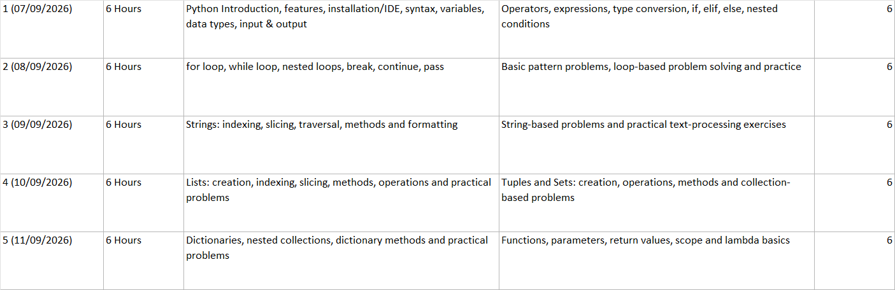

<div align="center">

# 🎓 VRSE_Vijayawada — 5-Day Training

### Campus Recruitment Training (CRT) — Complete Course Resources

<p>


</p>

</div>

---

## 📖 About This Training

This repository contains the **complete course material delivered during a 5-Day Campus Recruitment Training (CRT) program at VRSE, Vijayawada**.

The training was designed to help students build a strong foundation in **Python, Problem Solving, Programming Patterns, and logical thinking**, with an emphasis on **placement-oriented coding and practical programming skills**.

The repository contains the resources used throughout the training, including:

-> 🐍 Python programming concepts & programs  
-> 🧠 Problem-solving exercises  
-> 📚 Programming patterns  
-> 💻 Classroom coding programs  
-> 📝 Practice questions  
-> 📄 Day-wise training PDFs  
-> 📋 Training syllabus  
-> 📓 Jupyter Notebook resources  
-> 🔄 Study material

---

## 📝 TOC

<div align="center">



</div>

---

## 🎯 Training Objective

The primary objective of this training was to help students move from:

```text
       Programming Fundamentals
              ↓
       Python Programming
              ↓
       Logical Problem Solving
              ↓
       Programming Patterns
              ↓
       Problem Solving Practice
              ↓
       Placement-Oriented Coding
```

<br>
<p align="center">
  <a href="https://github.com/pavanpadavala2005/Problem_Solving">
    
  </a>
</p>
